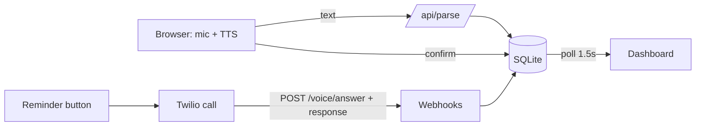

# UdhaarBuddy: Final Hackathon PRD (merged v2.0)
**Timeline:** 48 hrs (24-hr fallback included) | **Status:** locked scope | **Supersedes:** 01-PRD (vision) and the hackathon PRD draft. 02-07 stay as the production roadmap.

## 1. Pitch
> **"Ek mic. Ek sentence. Ek call."**
> Kirana owner bolta hai *"Mohan ne 500 ka udhaar liya"* → ledger entry ban jaati hai → deadline par customer ko **consent ke saath** automated call jaati hai → jawab dashboard par live aata hai. Dispute aur opt-out built-in.

## 2. Problem
| Problem | Impact |
|---|---|
| Paper khaata kho jaata hai, entries par jhagda | Paisa doobta hai, rishte bigadte hain |
| Busy counter par typing slow | Owners digital tools chhod dete hain |
| Udhaar maangna awkward | Owner yaad nahi rakhta, cash-flow atakta |
| Apps English + forms wale | Hinglish owner ke liye unusable |

*Pitch mein ek verified statistic add karo (kirana count / informal credit) with source. Bina source ke number mat bolo.*

## 3. Users
**Ramesh (45)**, kirana owner: Hinglish, busy, forms nahi bharega. **Mohan (30)**, credit customer: smartphone hai, call uthayega, galat hisaab par aapatti kar sakta hai.

## 4. Scope (MUST BUILD)

### F1: One-sentence voice/text entry (core)
- Chrome Web Speech API (`hi-IN`) mic button + **type mode fallback** + ek "pre-saved sentence" button (noisy hall ke liye).
- Parser: rules + number-words (`dedh sau`, `paanch sau`) + Devanagari digits/naam + LLM JSON fallback (sirf agar time bache).
- Output: `{customer, type: credit|payment, amount, item, qty}`.
- **Context memory:** "uska 200 jama" = last active customer (client state, 2 min idle par expire).
- **Tap-to-confirm** card. Voice "Haan" bonus hai, demo par tap reliable hai.
- **Voice readback** (browser TTS hi-IN): *"Mohan ka paanch sau rupaye ka udhaar likh diya."*

### F2: Confidence + clarify
- Customer ya amount clear nahi: ek Hinglish sawaal + 2 bade buttons ("Kaun Mohan?"). Kabhi guess nahi.
- Gibberish par crash nahi: "Dobara boliye".

### F3: Customers + derived balance + immutable ledger
- Balance = credit − payment (voided rows chhodkar). Stored column nahi.
- Correction = **naya row** (`amends`), purana voided. History mein dono dikhte hain.

### F4: Reminder + live Twilio call (wow moment)
**Call se pehle checks (sab pass hone chahiye):** consent = yes, opted_out = no, dispute open nahi, balance > 0.

**Script (fixed, Devanagari TTS, koi free-form AI nahi):** appendix A.

| Digit | Meaning | Result |
|---|---|---|
| **1** | Kal tak dunga | `promised`, owner ko live update |
| **2** | Kuch din baad | `promised` (later), owner ko live update |
| **3** | Yeh hisaab mera nahi | **`disputed`**, calls ruk jaati hain, owner alert |
| **0** | Aage calls nahi chahiye | customer `opted_out`, kabhi call nahi |
| koi aur / kuch nahi | Script dobara ek baar, phir polite end | attempt log |

DTMF primary. Speech (`input="dtmf speech"`) sirf stretch goal. (Pehle draft mein "2 = unclear" tha. Ab 2 ek actual jawab hai.)

Webhook safety: Twilio signature validation, CallSid idempotency, balance ≤ 0 par "koi udhaar baaki nahi" script.

### F5: Dashboard
- Stats: total udhaar, debtors, called / promised / disputed.
- Weekly chart (Chart.js, entries se derive).
- Live outcome: 1.5 s polling + toast "Mohan ne kal tak vaada kiya".

### F6: Demo hygiene
Consent toggle (demo numbers), **seed reset button** (Mohan, Sunita customers; Ramesh = owner), "automated call" line script mein, backup call video.

## 5. Responsible by design (yehi hume alag banata hai)
| Guardrail | Demo mein kya dikhta hai | Production mein |
|---|---|---|
| **Consent** | Toggle "customer ne YES bola" | SMS/WhatsApp opt-in, consent events stored |
| **Dispute path** | Digit 3 par badge + calls band | Dispute list, owner-customer resolution |
| **Opt-out** | Digit 0 | STOP/0 turant, queued calls cancel |
| **Automated disclosure** | Script ki pehli line | Same, plus shop ka naam |
| **Immutable ledger** | Amend = naya row | Audit log, receipt hash |
| **Fixed script** | Koi threat/shaming nahi | Legal-reviewed script |
| **Limits** | Constants in code | 09:00-19:00 IST window, 3 attempts, 50 calls/day/shop |
| **No recording** | Sirf digit + outcome store | Transcript only, recording off by default |

## 6. Out of scope (slide par roadmap, code mein nahi)
Offline ASR, wake-word, Flutter, OTP login (simple login/hardcoded owner), DLT, retries/call windows, WhatsApp fallback, real consent SMS, QR receipts, multi-tenant RLS, pen-test, FCM.
**Line:** *"Yeh sab production roadmap mein hai (docs 02-07). Aaj sirf wahi jo chalta hai."*

## 7. Demo story (3.5 min) + Plan B
| # | Step | Plan B agar fail ho |
|---|---|---|
| 1 | 🎤 "Mohan ne 3 kilo atta paanch sau ka udhaar liya", card, tap, **app bolke confirm kare**, balance ₹500 | Pre-saved sentence button |
| 2 | 🎤 **"uska 200 jama ho gaya"** (context memory), balance ₹300 | Type mode |
| 3 | Reminder set (aaj), judge ka verified number | Teammate ka number |
| 4 | 📞 Live call, judge **1** dabata hai, dashboard **"Mohan ne kal tak vaada kiya ✅"** | Backup video |
| 5 | Reset, dobara call, judge **3**, **DISPUTED badge, calls band**: *"Hum harassment tool nahi bana rahe."* | Backup video |
| 6 | Ek line: consent, immutable ledger, roadmap slide | n/a |

## 8. Tech stack (locked)
| Layer | Choice |
|---|---|
| Frontend | React/Next.js + Tailwind (PWA, Chrome mobile) **ya plain HTML** (09-build-guide.md wala, tez) |
| Voice in/out | Web Speech API `hi-IN`, `speechSynthesis` |
| Parser | Rules + number-words + optional LLM JSON |
| Backend | Node (Express/Fastify) + SQLite |
| Calls | Twilio Programmable Voice + TwiML, ngrok/cloudflared |
| Live updates | 1.5 s polling |

## 9. Timeline (48 hrs)
| Hrs | Kaam | Owner |
|---|---|---|
| 0-2 | **Twilio hello call**, judge numbers verified, ngrok, DB schema + seed | Backend |
| 2-10 | Home: mic, preview, confirm, readback, entries, balance | Frontend |
| 2-10 | Parser + 30-40 test sentences + context memory | NLU |
| 10-18 | Reminder + dispatch + `/voice/answer` + `/voice/response` (1/2/3/0) | Backend |
| 10-18 | Customers, history, DISPUTED badge, consent toggle, clarify buttons | Frontend |
| 18-26 | Dashboard stats + chart + toast + polling | Frontend + Backend |
| 26-34 | Signature check, CallSid dedupe, balance skip, opt-out, reset button | Backend |
| 34-40 | Rehearsal x3, bug fixes, **backup video** | Sab |
| 40-46 | Pitch deck + README | PM |
| 46-48 | Buffer | Sab |

**24-hr fallback:** hardening = signature + dedupe; dashboard = list (no chart); parser = 15 sentences; clarify = customer picker only.

## 10. Success criteria
| Metric | Target |
|---|---|
| Demo 3.5 min bina crash | 3/3 rehearsals |
| Voice entry to saved | < 5 s |
| Call outcome to dashboard | < 2 s |
| Parser accuracy (test set) | > 90% |
| Wow moments | "uska" context memory + dispute path |

## 11. Judging alignment
| Criterion | Hamara jawab |
|---|---|
| Problem / impact | Real udhaar problem, Hinglish owners, recovery + fewer disputes |
| Innovation | Voice ledger + consent-gated auto calls + dispute-aware IVR |
| Technical depth | Hinglish NLU, context memory, Twilio webhooks (signed, idempotent), immutable ledger |
| Feasibility | Live working demo, roadmap ke docs ready |
| Responsibility | Consent, opt-out, dispute, fixed script |
| Presentation | 3.5 min story with a live call + backup |

## 12. Business model (1 slide)
- **Free:** voice ledger.
- **Paid:** reminder calls as credit packs or a monthly plan per shop. Unit cost = provider per-minute rate x ~40 s, so **current Twilio/India rate check karke** slide par number daalo.
- **Later:** WhatsApp reminders, UPI collect links, distributor credit visibility.
- **GTM:** kirana associations, distributors who already see shops' credit.

## 13. Risks
| Risk | Mitigation |
|---|---|
| Twilio trial: unverified numbers par call nahi jaati, India geo permission | Step 1 mein hi test, judge numbers pehle verify |
| Venue Wi-Fi / ngrok URL badla | Hotspot, URL update checklist, backup video |
| Mic noisy hall mein fail | Type mode + pre-saved sentence |
| Parser galat samjhe | Confirm card + clarify, kabhi silently save nahi |
| Judge sawaal: "Yeh legal hai?" | Q&A neeche |

## 14. Judge Q&A cheat-sheet
| Sawaal | Jawab |
|---|---|
| Consent kaise? | Opt-in: customer YES bole tabhi call. Demo mein toggle, production mein SMS/WhatsApp. STOP/0 se turant band. |
| Customer galat hisaab bataye? | Digit 3: dispute, calls band, owner ko alert. Ledger immutable hai, correction visible. |
| Ye harassment toh nahi? | Fixed polite script, calling window, attempt limits, automated disclosure, no recording. |
| AI kahan hai? | NLU (Hinglish to structured entry), context memory. Call par free-form AI jaanbujhkar nahi: predictable aur safe. |
| Scale kaise? | Offline-first, on-device ASR, DLT compliance, provider choice (docs 02-07). |
| Privacy / DPDP? | Phone encrypted, purpose limitation, erasure endpoint, India region. Roadmap mein. |
| Revenue? | Reminder-call credits per shop. |

## Appendix A: Call script (Devanagari, TTS ke liye)
> नमस्ते {नाम} जी। यह {दुकान} की तरफ़ से एक ऑटोमेटेड कॉल है। आपका {रकम} रुपये का उधार बाकी है। कल तक देने के लिए 1 दबाइए। कुछ दिन बाद देने के लिए 2 दबाइए। अगर यह हिसाब आपका नहीं है, तो 3 दबाइए। आगे कॉल नहीं चाहिए, तो 0 दबाइए।

## Appendix B: Parser test sentences (starter)
| Sentence | Expected |
|---|---|
| Mohan ne 3 kilo atta paanch sau ka udhaar liya | Mohan, credit, 500, atta, 3 kilo |
| मोहन ने 200 जमा किया | Mohan, payment, 200 |
| sunita ko dedh sau udhaar | Sunita, credit, 150 |
| Mohan ne 2 packet chai 40 ka | Mohan, credit, 40, chai, 2 packet |
| uska 200 jama ho gaya | last customer, payment, 200 |
| Mohan ne 500 wapas diye | Mohan, payment, 500 |
| ek hazaar udhaar Sunita ko | Sunita, credit, 1000 |
| Mohan 3 kilo atta (amount nahi) | clarify: "Kitne ka?" |
| Mohan | clarify: kya likhna hai |
| asdf qwer | "Dobara boliye" |

## Appendix C: Build delta (09-build-guide.md mein jo abhi nahi hai, jodna hai)
1. **Context memory** ("uska"): frontend mein `lastCustomerId`, parse ke baad agar `customer_id` null aur text mein "uska/usko/उसका" ho toh use karo.
2. **Clarify UI**: `candidates` / null amount par 2-4 bade buttons.
3. **Readback**: save ke baad `speechSynthesis` (guide mein sirf pre-confirm prompt hai).
4. **Stats + chart**: `GET /api/stats` (total, debtors, counts) + Chart.js weekly.
5. **Reset**: `POST /api/reset` (entries clear, reminders scheduled, seed reload).
6. **Digit 2** ab `promised (later)` hai (guide mein pehle se same).
7. Seed: owner Ramesh alag, customers Mohan aur Sunita.
